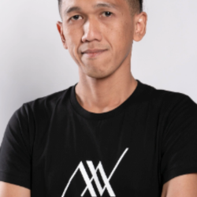
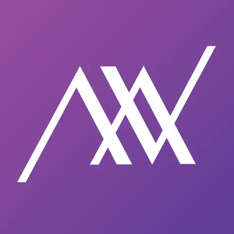
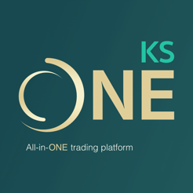

# Adisak Jarernpol (A)
# Technical Lead Mobile iOS developer

👋 Hi, I'm A , I'm a passionate iOS Tech Lead with 5 years of experience in developing high-quality mobile applications.
Work in finance industry 8 years, so I have strong understanding of financial products and services.

## Experience

### 🚀 R'ket
**Technical Lead Mobile iOS**  
*Nov 2023 - Present · 1 yr 6 mos*  
Bangkok, Bangkok City, Thailand 

### 📊 AVA ADVISORY
**Technical Lead Mobile iOS**  
*Jan 2021 - Nov 2023 · 2 yrs 11 mos*  

**Senior Software Engineer**  
*Apr 2015 - Apr 2020 · 5 yrs 1 mo*  
Bangkok, Bangkok City, Thailand 

### 💻 Market Anyware
**Software Engineer**  
*Apr 2009 - Apr 2015 · 6 yrs 1 mo*  
Bangkok, Bangkok City, Thailand 

## What I do past 5 years
- Manage, coach, and support engineering team iOS.
- Lead the design/development of large-scale software solution.
- Time management and prioritization for deliver product on time
- Design and implement system architecture
- Code review and provide guidance
- Troubleshoot and debug complex issues
- Optimize app performance and maintainability
- Looking help and support careers path for team members
- Participate in knowledge sharing.

## 🛠 Technical Skills
- Expert in iOS skills using `Swift` and `Objective-C`.
- Design Patterns `Clean Architecture`, `MVVM`, `MVC`, `MVP`
- Familiar with CI/CD process, with `Fastlane` and `Jenkins`
- Experience in `Codesign` for working with multiple team members
- Experience with unit both `XCTest` and `SwiftTesting`
- Experience with UI testing `Cucumber` or `XCUITest`
- Design architecture for APIs or Real-time data like `WebSockets`
- Experience in apply `OWASP mobile security testing guide` to secure app
- Understanding of `iOS` and `Android` security implementation data storage like `Keychain`, `Secure Enclave`
- Experience in implement `e-KYC`, `AML`
- For AI, I have experience in setup `Cursor` for iOS development team
- Implement `MCP` for our team to work smoothly with design team
- For Blockchain, I have experience in convert `pancake-swap-sdk` to `Swift` be create `AvantisSwapSDK`

## 📫 Get in Touch
- Mobile: [0850592546](tel:+66850592546)
- LinkedIn: [Adisak Jarernpol](https://www.linkedin.com/in/daisyfoto/)
- Email: daisyfoto.ai@gmail.com

## 🎓 Education
**Mahanakorn University of Technology**  
Bachelor's Degree, Computer Engineering  
*2005 - 2009*
  
## 📱 Featured Projects

### R'ket - Insightful Investment
**App Store Link**: [Download](https://apps.apple.com/th/app/rket-insightful-investment/id6445971302)

### AVA Advisor

- **App Store Link**: [Download](https://apps.apple.com/th/app/ava-advisor/id1204640737)

### KS One

- **App Store Link**: [Download](https://apps.apple.com/th/app/ks-one/id1605525381?l=th)
